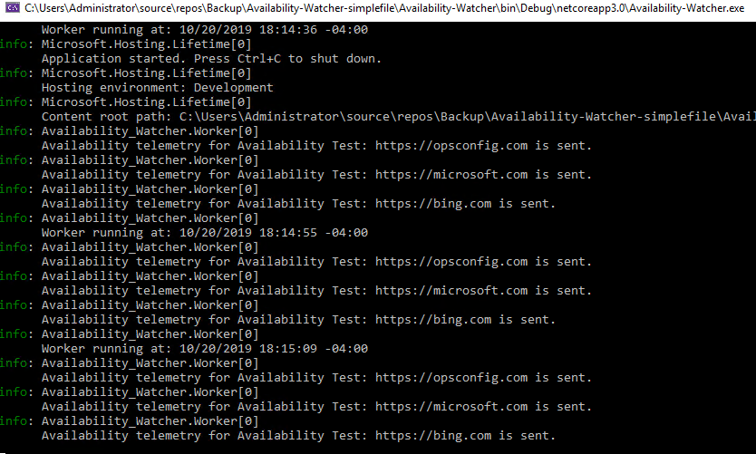
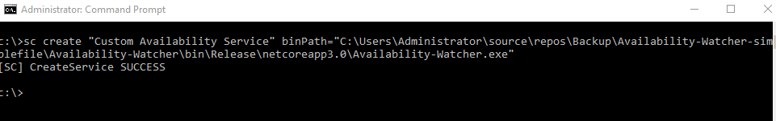

# availability-watcher
Proof of concept side-project using a .NET Core 3.0 Worker Service for Azure Monitor - Application Insights Availability monitoring in hybrid/on prem environments running as Windows Service.

## Overview

When monitoring an application you always want to have a combination of internal instrumentation coupled with external monitoring/synthetic transactions that give you visibility into the overall health of your app. If you only have internal instrumentation you can't detect when the server running your app is down, because it isn't sending any exceptions, traces, or errors, it's just dead. So to counter this you add external monitoring that is in no way dependent on your application or its core infrastructure which can provide an outside in view.

In the Azure Monitor world this type of external syntethtic transaction based monitoring comes in the form of [Application Insights Availabilty tests](https://docs.microsoft.com/azure/azure-monitor/app/monitor-web-app-availability). The default availability tests are built via the portal and allow you to spin up external test agents all over the world to check on the health of you application or endpoints. This is incredibly useful, but there are cases where for various security reasons you may not want to allow any incoming traffic from the public internet to your endpoints even if it means opening up your firewall for specific Microsoft owned IP addresses.

If you are in this situation your primary option is to use the TrackAvailability() method call and send your own custom availability telemetry. Microsoft put together an example of running TrackAvailability() from within an Azure Function in [this article](https://docs.microsoft.com/azure/azure-monitor/app/availability-azure-functions). This is helpful if you using a VNET or want a good starter example of how to make a custom TrackAvailability() call, but it doesn't help you out if you are in a Hybrid environment and might want to be able to run availability monitoring on on-premises servers. 

This sample takes the code from Availability monitoring functions article and does a few things:

- Removes the Azure Function specific code, and makes it so it can run standalone in a .NET Core 3.0 Worker Service.
- Removes the content match (I'll add it back later as modifiable parameter)
- Reads the ikey from a config file.
- Reads a separate config file and generates a list of URLs/Endpoints to test based on the contents of the file. (The Azure Function example took a single hardcoded url)
- Adds the ability for the published .exe file to be installed/run as a standard windows service controllable via services.msc.

## Please Note:

This is not intended for production use, and is just a sample to help give you ideas/get started. My current way of handling configuration input is extremely fragile and not a solution I would ever recommend. If I have time I will keep cleaning this up and adding to it.

At a minumum I am planning to add the following:

- Ability to send to multiple ikeys. Currently you can send to multiple endpoints but the telemetry all goes to the same ikey.
- Refactor to use the new [Application Insights for Worker Services](https://docs.microsoft.com/azure/azure-monitor/app/worker-service) packages. This is the new preferred method of using App Insights + Worker Services and would light up features like Live Metrics, and heartbeat out-of-box, and would provide a more stable method of setting the ikey for a single environment via the appsettings.json rather than more current extremely clunky read from a text file named ikey method.

## Prerequisites:

- To work with the Visual Studio project files you need at least Visual Studio 2019 16.3.5
- To run Availability-Watcher.exe standalone or as a windows service you need at least Microsoft.NETCore.App' [version 3.0.0 Runtime](https://dotnet.microsoft.com/download/dotnet-core/3.0). 
- An instrumentation key + a test Application Insights resource to send avaiability telemetry to. If you don't have an Application Insights resource you an create one by following [these instructions](https://docs.microsoft.com/azure/azure-monitor/app/create-new-resource). 

## Getting up and running

### Visual Studio 2019

If running from VS 2019 just make sure you have a valid config.txt and ikey.txt file in the `Availability-Watcher-simplefile\Availability-Watcher` directory. 

The ikey.txt file should contain a single line with no spaces just conisting of your Application Insights instrumentation key in the form: `afc62271-f6c9-55aa-5555-f573727e0b3f`. The config.txt file should contain your list of endpoints with each endpoint you want to test on a separate line (again not the way I plan to do this eventually, but this is a simple proof of concept). So when opened the file should look like:
```
https://microsoft.com
https://docs.microsoft.com
https://bing.com
https://outlook.com
```
When running via Visual Studio you will see output like this:



### Test .exe locally

If you don't want to look at the code in Visual Studio and you just want to try out the very basic functionality as it currently stands you can do the following:
1. Go to Availability-Watcher-simplefile\Availability-Watcher\bin\Release\netcoreapp3.0\.
2. If they are not currently present add an ikey.txt file and config.txt file to this directory following the same instructions from the Visual Studio section above except place the files in the same directory as the Availability-Watcher.exe.
3. Right-click and run Availability-Watcher.exe as admin.

When running direct via the .exe it should look like this:


### Run as a Windows Service

If you don't want to look at the code in Visual Studio and you just want to try out the very basic functionality as it currently stands you can do the following:
1. Go to Availability-Watcher-simplefile\Availability-Watcher\bin\Release\netcoreapp3.0\
2. If they are not currently present add an ikey.txt file and config.txt file to this directory following the same instructions from the Visual Studio section above except place the files in the same directory as the Availability-Watcher.exe.
3. Open an administrative command prompt.
4. Run `sc create <new_service_name> binPath "path-to-availability-watcher\availability-watcher.exe"`



5. services.msc
6. Start your service


### What you will see in the console once your service is running:

- Summary Availabilty data with individual transaction durations:


