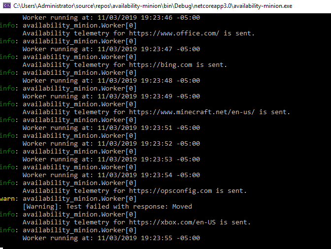
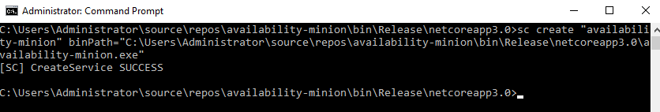
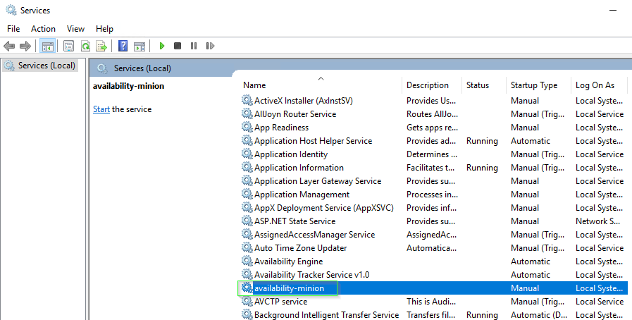
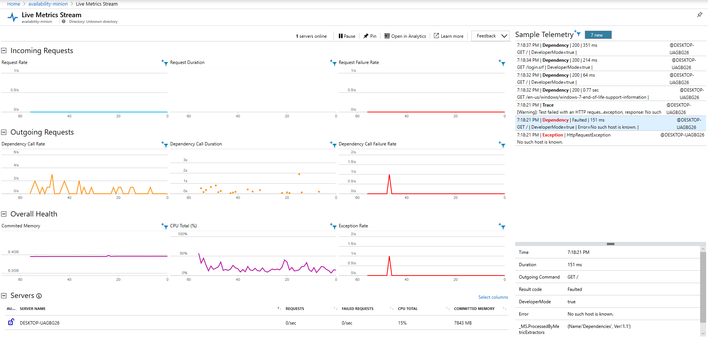
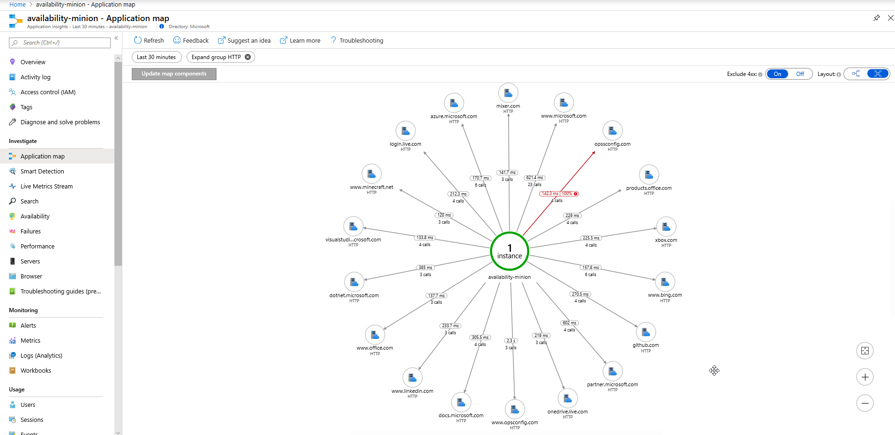
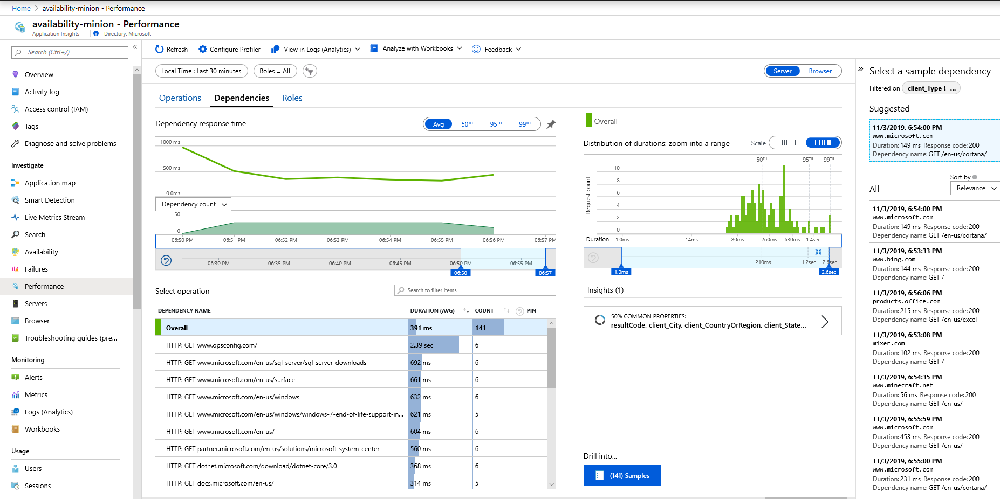
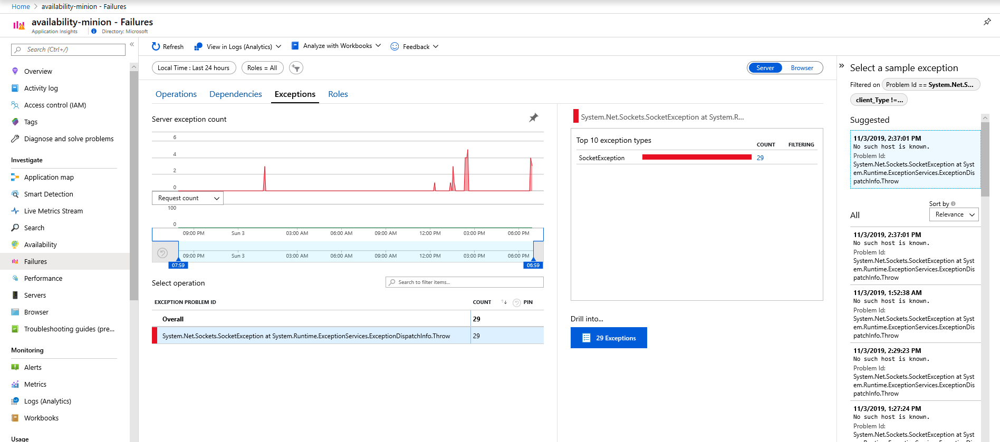
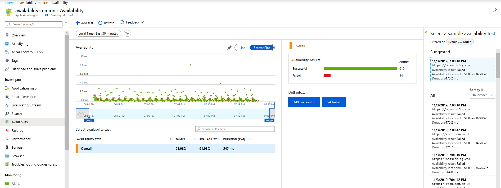
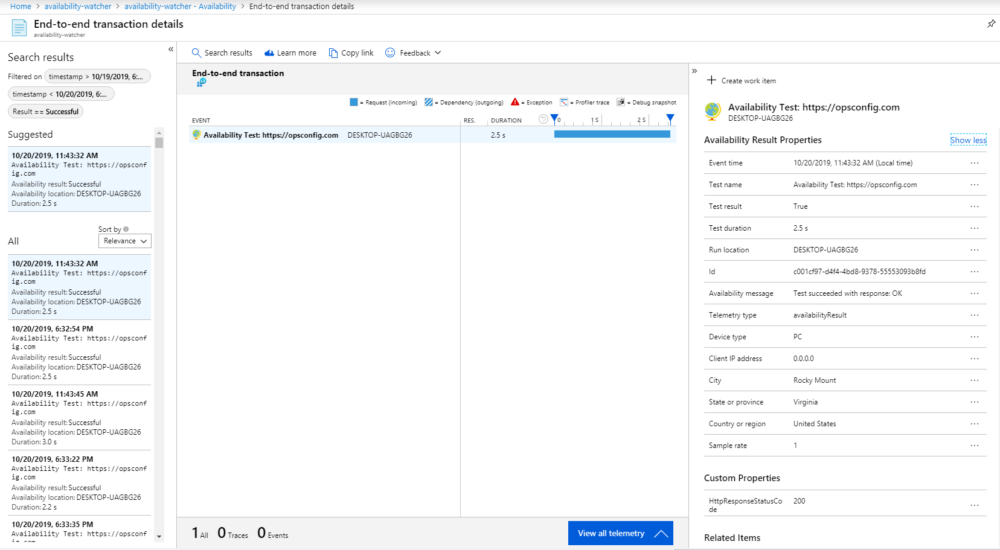

# availability-minion

## Prerequisites:

- To work with the Visual Studio project files you need at least Visual Studio 2019 16.3.5
- To run Availability-Watcher.exe or availability-minion.exe standalone or as a windows service you need at least Microsoft.NETCore.App' [version 3.0.0 Runtime](https://dotnet.microsoft.com/download/dotnet-core/3.0). 
- An instrumentation key + a test Application Insights resource to send avaiability telemetry to. If you don't have an Application Insights resource you an create one by following [these instructions](https://docs.microsoft.com/azure/azure-monitor/app/create-new-resource). 
- This solution **does not require any inbound connections** being opened in your network to the public internet, but it does still require limited outbound communication so that telemetry can be sent to the appropriate endpoint in Azure.

## Updates:

- Cloud role name is now set via telemetry initializer to "Minion". (Previously no cloud role name was set).
- config.txt file no longer has to be in the same directory as the availability-minion .exe. The directory where the .exe is being run from is checked first, but if the file is not present it will check for the presence of the file in `C:\Program Files\Minion`. (This was added to remove the need to place the config.txt file in sytem32 when running the minion as a windows service).
- User-Agent is set to: "Mozilla/5.0 (compatible; minionbot/1.0)"
- If you need to send to multiple different ikeys use the new [availabilty-minion-multi](https://github.com/mrbullwinkle/availability-watcher/tree/master/availability-minion-multi).
 
## Visual Studio 2019

If running from VS 2019 just make sure you have a valid config.txt file in the `availability-minion` directory.
**Set your instrumentation key in the appsettings.json file**. 

The config.txt file should contain your list of endpoints with each endpoint you want to test on a separate line (again not the way I plan to do this eventually, but this is a simple proof of concept). So when opened the file should look like:
```
https://microsoft.com
https://docs.microsoft.com
https://bing.com
https://outlook.com
```
When running via Visual Studio you will see output like this:



## Test .exe locally

If you don't want to look at the code in Visual Studio and you just want to try out the very basic functionality as it currently stands you can do the following:
1. Go to `Availability-minion\bin\Release\netcoreapp3.0\`
2. If they are not currently present add a config.txt file to this directory following the same instructions from the Visual Studio section above except place the file in the same directory as the availability-minion.exe. Make sure the appsettings.json file in this directory contains the intrumentation key where you want your availability telemetry to be sent.
3. Right-click and run availability-minion.exe as admin.

When running direct via the .exe it should look like this:


## Run as a Windows Service

If you don't want to look at the code in Visual Studio and you just want to try out the basic functionality running as a windows service do the following:
1. Go to `availability-minion\bin\Release\netcoreapp3.0\`
2. If not currently present add a config.txt file to this directory following the same instructions from the Visual Studio section above except place the files in the same directory as the availability-minion.exe. Like the instructions above the instrumentation key must now be set in the appsettings.json file.
3. Open an administrative command prompt.
4. Run `sc create <new_service_name> binPath="path-to-availability-minion\availability-minion.exe"`


5. Copy your config.txt file to `C:\Windows\System32` (I will fix this later so the file doens't need to be in this location). 
6. services.msc
7. Start your service



If you experiment with running this as a windows service for an extended period of time some steps you will probably want to take are:

- Set the service to automatic.
- Set the default action of the service on first and second failure to restart.
- Create a restricted service account to run the service, by default it runs as Local System.
- Add a scheduled task with a custom script to check the status of the service and restart if it stops running.

## What you will see in the Azure portal once your service is running:

- Live Metrics:



- Application Map:



- Dependency Performance:



- Failure/Exceptions:



- Summary Availabilty data with individual transaction durations:



- Ability to drill into end-to-end transaction details:



- Azure Monitor Logs stores all the availability transactions which can be easily accessed via Log Analytics + Kusto queries:


One can then build custom log and metric based alerts to notify as soon as an outage is detected.

